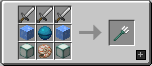
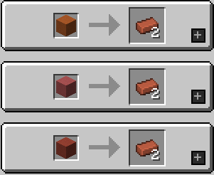

一个简单的 **1.14.4** 原版生存服务器

## 服务器地址

- 自动解析: **nekocraft.net**
- 电信: **dx.nekocraft.net**
- 联通: **lt.nekocraft.net**

## 服务器特点

- 正版验证 *(你必须要拥有国际版 Minecraft 的正版账号)*
- 公益服 *(仅接受无条件赞助)*
- 已加入 [Minecraft 公益宣言](https://nonprofit-minecraft.org)

## 交流群组

- Telegream: [@NekoCraft](https://t.me/NekoCraft)
- QQ群: [7923309](https://jq.qq.com/?_wv=1027&k=5NWK20A)

## 服务器详细信息

### 特性

1. 添加了 `OptiCrafting` 服务器优化数据包 *(可合成鞘翅 & 三叉戟等)*: [(点此查看)](https://www.bilibili.com/read/cv3138258).
2. 添加了一些合成表 *(如僵尸生成蛋 & 拆解鞍等)*, 请转到文章结尾查看.
3. 只需要半数玩家睡觉即可跳过夜晚, 同时不会统计挂机钓鱼的玩家.
4. 杀死 **海龟** 可以获得鳞甲.
5. 击杀 **劫掠兽** 不掉落马鞍, 而是掉落皮革.
6. 在聊天框中以 `<某位玩家名字>空格` *(比如说: Notch 你好)*, 会提醒该玩家查看信息.
7. 安装有砍树插件, 使用 **钻石斧** 或 **铁斧** 可以快速砍树.
8. 安装有座椅插件, **空手** 右键点击 **木制楼梯** 可以坐上去, 同时还可以缓慢恢复血量.

### 可以使用的指令

- `/show`: 展示当前手中的物品
- `/toggle`: 在生存和观察者模式中切换
- `/home`: 回家
- `/sethome`: 设置家
- `/back`: 回到上一位置
- `/gc`: 查看服务器当前状态
- `/world`: 在不同世界间传送
- `/tpa <目标玩家>`: 请求传送到一个玩家身边
- `/tpahere <目标玩家>` 或 `/tpah <目标玩家>`: 请求一个玩家传送到你的身边
- `/tpaall`: 请求全服玩家传送到你的身边
- `/co`: CoreProtect 插件相关指令, 可以查看方块放置及破坏, [点我看帮助](http://mineplugin.org/CoreProtect#.E5.91.BD.E4.BB.A4)

## 玩家准则

- 若违反以下规定会直接封禁账号
  1. 不允许随意破坏他人建筑
  2. 不允许破坏公有建筑
  3. 没有经过管理员许可大规模破坏地形

- 若违反以下规定会暂时封禁账号
  1. 不允许没有经过他人同意随意拿取物品
  2. 不允许没有经过他人同意杀死他人生物
  3. 不允许大量拿取公有物品
  4. 不允许建造过于卡顿的红石机器
  5. 不允许密集养殖生物 *(包括村民 & 掉落物 & 动物)*
  6. 不允许恶意宣传服务器 *(包括宣传他人服务器和进入他人服务器宣传本服务器)*
  7. 不允许辱骂他人

- 其他
  1. 如果发现你的个人资产 *(建筑、物品、动物等)* 遭到他人损害请第一时间联系管理员, **禁止个人报复**
  2. 如果有回档需要可以联系管理员

> 另: 封禁时长视破坏严重性而定

## 管理团队

- 服主: [@AkechiSatori](https://t.me/AkechiSatori)
- 管理员: [@BBleae](https://t.me/BBleae)
- 管理员: [@Shirasawa](https://t.me/Shirasawa)

## 合成表

### 工作台

### 切石机

