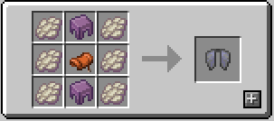
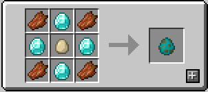
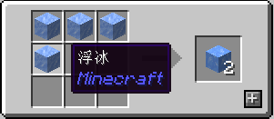
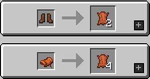

# NekoCraft - 服务器规定及介绍

一个简单的原版生存服务器

## 服务器地址

- **自动选择:** neko-craft.com
- **直连地址:** play.neko-craft.com
- **电信:** dx.neko-craft.com
- **移动:** yd.neko-craft.com
- **联通:** lt.neko-craft.com
- **基岩版:** be.neko-craft.com

## 服务器特点

- 正版验证 *(你必须要拥有国际版 Minecraft 的正版账号)*
- 公益服 *(仅接受无条件赞助)*
- 已加入 [Minecraft 公益宣言](https://nonprofit-minecraft.org)

## 交流群组

- Telegram: [@NekoCraft](https://t.me/NekoCraft)
- QQ群: [7923309](https://jq.qq.com/?_wv=1027&k=5NWK20A)

## 服务器详细信息

### 特性

1. 添加了 `OptiCrafting` 服务器优化数据包 *(可合成鞘翅 & 三叉戟等)*: [(点此查看)](https://www.bilibili.com/read/cv3138258).
2. 添加了一些合成表 *(如僵尸生成蛋 & 拆解鞍等)*, 请转到文章结尾查看.
3. 只需要半数玩家睡觉即可跳过夜晚, 同时不会统计挂机钓鱼的玩家.
4. 杀死 **海龟** 可以获得鳞甲.
5. 击杀 **劫掠兽** 不掉落 *马鞍* , 而是掉落 *皮革* .
6. 击杀 **女巫** 不掉落 *酿造好的药水*.
7. 击杀 **卫道士** & **掠夺者** & **唤魔者** 不掉落 *旗帜* 与 *斧头*.
8. 点击聊天框中的玩家名可以快速 @ 该玩家.
9. 点击聊天框中的聊天内容可以直接复制文本.
10. 在聊天框中以 `<某位玩家名字>空格` *(比如说: Notch 你好)*, 会提醒该玩家查看信息.
11. 安装有座椅插件, **空手** 右键点击 **楼梯** 可以坐上去.
12. **僵尸** 无法拾起 *鸡蛋* 和 *腐肉*.
13. 服务器地图种子: `609567216262790763`.
14. **末影人** 无法捡起和放下方块.
15. **湿海绵** 拥有类似 **海绵** 吸水一样的特性, 但可以吸收的是 **岩浆**, 吸收后将变成 **哭泣的黑曜石**.
16. **海草** 和 **竹子** 最大高度与其根部方块在当前世界的坐标有关, 随机的高度在 2 到 15 之间.
17. 雷暴天气时, 手中拿着或身着铁质、金质或下界合金制护甲或物品, 或者站在露天的树底下时被雷击的风险会增大.
18. 雷暴天气时, 铁质、金质或下界合金制的物品掉落物暴露在雨中时, 会有几率被雷击.
19. 发生雷击时, 距离雷电实体距离 **16格以内** 的铁质、金质或下界合金制的方块可以吸引雷电. 若其底下的方块为 **原木**, 成功吸引雷击后会转化为 **煤炭块**.
20. 右键点击 **龙蛋**, 龙蛋不会瞬移.
21. 在 **耕地** 上跳跃不会破坏 **耕地**.

### 可以使用的指令

- `/show`: 展示当前手中的物品
- `/toggle`: 在生存和观察者模式中切换
- `/home`: 回家
- `/sethome`: 设置家
- `/back`: 回到上一位置
- `/spawn`: 回到出生点
- `/tpa <目标玩家>`: 请求传送到一个玩家身边
- `/tpahere <目标玩家>`: 请求一个玩家传送到你的身边
- `/tpaall`: 请求全服玩家传送到你的身边
- `/disrobe`: 强行脱下身上的盔甲
- `/status`: 显示当前服务器状态
- `/co`: CoreProtect 插件相关指令, 可以查看方块放置及破坏, [点我看帮助](http://mineplugin.org/CoreProtect#.E5.91.BD.E4.BB.A4)
- `/w` & `/welcome`: 无感情的迎新机器
- `/afk`: 进入或退出挂机模式
- `/warp`: 传送至服务器地标

## 玩家准则

- 若违反以下规定会直接封禁账号
  1. 不允许随意破坏他人建筑
  2. 不允许破坏公有建筑
  3. 没有经过管理员许可大规模破坏地形 (空置域请提前申报)
  4. 不能使用黑卡/迁移账号进入服务器
  5. 不允许开挂 (包括但不限于 **矿物透视/飞行/快速奔跑**) *(包括他人举报、被管理员发现或公开在聊天信息中声称自己开挂)*

- 若违反以下规定会暂时封禁账号
  1. 不允许没有经过他人同意随意拿取物品
  2. 不允许没有经过他人同意杀死他人生物
  3. 不允许大量拿取公有物品
  4. 不允许建造过于卡顿的红石机器
  5. 不允许密集养殖生物 *(包括村民 & 掉落物 & 动物)*
  6. 不允许恶意宣传服务器 *(包括宣传他人服务器和进入他人服务器宣传本服务器)*
  7. 不允许辱骂他人和阴阳怪气他人
  8. 不允许长期使用红石机械进行区块加载

- 拿取物品相关相关
  1. 拿取野箱 *(周围无明显的他人建筑的容器)* 中**贵重**的物品, 或者直接拿取他人领土中的任何物品一律封禁
  2. 临时借用他人物品请先征得他人同意, 或者在拿取之后在拿取处立个牌子标明你的id和借用时间和归还时间, 同时及时归还
  3. 请不要到处打开/翻弄他人的容器
  4. 如果你因为拿取他人物品被封禁, 可加入交流群解释缘由以解封, 同时及时归还

- 其他
  1. 如果发现你的个人资产 *(建筑、物品、动物等)* 遭到他人损害请第一时间联系管理员, **禁止个人报复**
  2. 如果有回档需要可以联系管理员
  3. 以出生点为中心, 四个对角线的 **五个区块** 内请不要随意建造建筑, 管理员有权在不通知的情况下直接清除, 同时 **自己在这个范围内建造的建筑** 被破坏也请不要联系管理员恢复
  4. 禁止在游戏或 QQ群 内展现、显示或说出某些低俗及令人反感的词语、图片或文字等
  5. 物品失窃/建筑被小规模破坏, **必须要物品/建筑所有者亲自举报**, 他人代举报一律无效 *(公有建筑视严重性决定是否处理)*
  6. 举报必须附上 `co` 插件的记录, 并且说明举报者的ID和被举报者的ID以及举报内容
  7. 举报可以私聊管理员 **(推荐)**, 也可以在群内at管理员, 同时如果管理员没有明确看到举报内容一律当做无效处理
  8. 管理员有权决定是否处理举报, 同时管理员的处理结果只允许服主产生异议, 玩家无权对处理结果进行反驳
  9. 请不要在任何世界距离出生点八个区块内使用床或者 TNT 破坏大片地形
  10. 服务器有权在不通知你的情况下进行规则修改
  11. 请不要恶意跑图, 以及滥用观察者模式进行地图探索和查找矿物
  12. 进入服务器前必须给您的正版账号设置一个皮肤, **(用于防止黑卡账号进入服务器)**, 若您的账号由于某些原因无法更换密码, 您可以联系管理员并提供相关购买证明
  13. 请不要建造过山车及只有超长的一格铁路线等影响美观且占地较大的建筑, 管理员将有权进行拆除
  14. 出生点新手物品给与处请不要存放钻石制、下界合金制品、潜影盒、信标和绿宝石等贵重物品 **(建议只提供食物及石制、铁质工具)**, 若放置贵重物品管理员将有权进行没收

> 另: 封禁时长视破坏严重性而定, 拿取他人物品被封禁想要解封请进群解释

## 管理团队

- 老服主: [@AkechiSatori](https://t.me/AkechiSatori)
- 现服主: [@Shirasawa](https://t.me/Shirasawa)
- 管理员: [@BBleae](https://t.me/BBleae)
- 管理员: @Fulandre_Scarlet
- 管理员: @Lulu_fengling
- 管理员: @Flandern_S
- 管理员: @Rukia0v0
- 管理员: @YtonE

## 合成表

### 工作台

### 切石机

## 结语

**最终解释权归 NekoCraft *(服主)* 所有**

点击同意规则按钮后则默认您已仔细阅读并遵守以上规定
